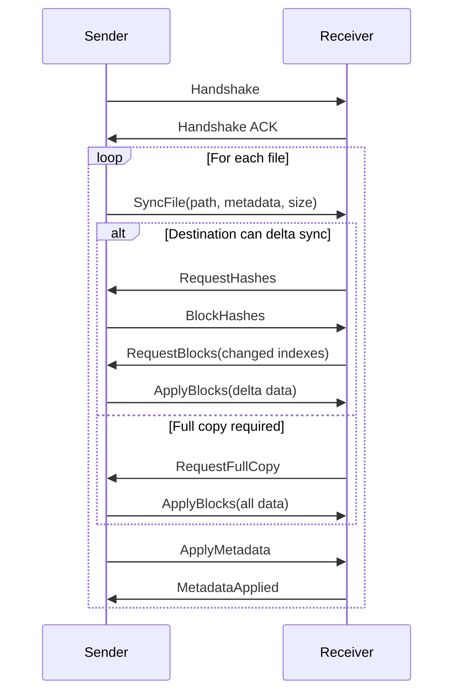
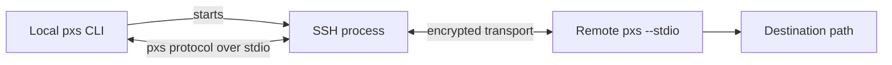
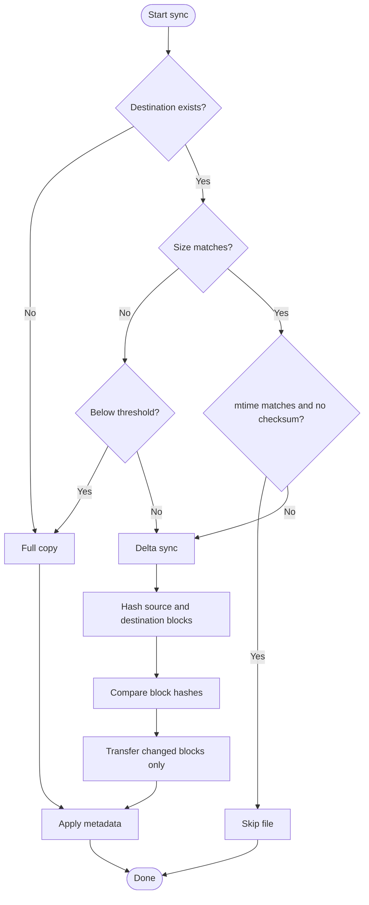

# pxs

[](https://github.com/nbari/pxs/actions/workflows/test.yml)
[](https://github.com/nbari/pxs/actions/workflows/build.yml)
[](https://codecov.io/gh/nbari/pxs)

**pxs** (Parallel X-Sync) is a file synchronization tool written in Rust for
the same broad job as `rsync`: move data trees efficiently and refresh existing
copies with as little work as possible.

The name is intentionally short for CLI use: `pxs` stands for **Parallel X-Sync**.

`pxs` focuses on modern large-data sync workloads, such as repeated refreshes
of large PostgreSQL `PGDATA` directories, VM images, and other datasets with
many unchanged files or large files that are updated in place.

`rsync` remains the reference point in this space. `pxs` is not a drop-in
replacement for it. The goal is narrower: use Rust performance, parallelism,
concurrency, fixed-block delta sync, and high-throughput transport to speed up
data synchronization for workloads where those choices help.

## Key Features

*   **Multi-threaded Engine**: Parallelizes file walking, block-level hashing, and I/O operations.
*   **Fixed-Block Synchronization**: Uses **128KB** chunks and **XxHash64** for ultra-fast delta analysis.
*   **High-Throughput TCP Transport**: Uses a compact binary protocol with **rkyv** serialization over raw TCP.
*   **Auto-SSH Mode**: Seamlessly tunnels through SSH for secure transfers without manual port forwarding.
*   **Pull Mode**: Supports both pushing to and pulling from remote servers.
*   **Staged Atomic Writes**: Preserves an existing destination until the replacement file is fully written and ready to commit.
*   **Smart Skipping**: Automatically skips unchanged files based on size and modification time.

## Installation

Install from crates.io:

```bash
cargo install pxs
```

Build from source:

```bash
cargo build --release
```
The binary will be available at `./target/release/pxs`.

> [!IMPORTANT]
> For **Network** or **SSH** synchronization, `pxs` must be installed and available in the `$PATH` on **both** the source and destination servers.

> [!NOTE]
> **Clock Synchronization**: When using mtime-based skip detection (the default without `--checksum`), ensure source and destination systems have synchronized clocks (e.g., via NTP). Clock skew can cause files to be incorrectly skipped or unnecessarily re-synced. Use `--checksum` to force content-based comparison if clock sync is not guaranteed.

## Platform Support

`pxs` currently targets **Unix-like systems only**:

*   Linux
*   macOS
*   BSD

Windows is **not supported**.

For network and `--stdio` transports, `pxs` uses normalized relative POSIX paths in the protocol. Incoming paths are rejected if they are absolute or contain `.` / `..` traversal components. Paths containing `\` are also rejected by the protocol, so filenames with backslashes are not supported for remote sync.

`pxs` also rejects destination roots and destination parent components that are symlinks. This is intentional: the tool may replace or delete leaf symlink entries inside the destination tree, but it will not write through a symlinked destination root or a symlinked ancestor path component.

## How It Works

### Local Synchronization


Mermaid source: [`docs/diagrams/local-sync.mmd`](docs/diagrams/local-sync.mmd)
Fallback image: [`docs/diagrams/local-sync.svg`](docs/diagrams/local-sync.svg)

### Network Synchronization (Direct TCP)



Mermaid source: [`docs/diagrams/direct-tcp.mmd`](docs/diagrams/direct-tcp.mmd)
Fallback image: [`docs/diagrams/direct-tcp.svg`](docs/diagrams/direct-tcp.svg)

### SSH Synchronization (Auto-Tunnel)



Mermaid source: [`docs/diagrams/ssh-flow.mmd`](docs/diagrams/ssh-flow.mmd)
Fallback image: [`docs/diagrams/ssh-flow.svg`](docs/diagrams/ssh-flow.svg)

### Delta Sync Algorithm



Mermaid source: [`docs/diagrams/delta-sync.mmd`](docs/diagrams/delta-sync.mmd)
Fallback image: [`docs/diagrams/delta-sync.svg`](docs/diagrams/delta-sync.svg)

## Usage

### `sync`
Use this when both source and destination are local paths on the same machine.
`sync` is the default local data-mover: it compares an existing destination and only rewrites changed blocks when delta sync is worthwhile.

Typical use:
- local file or directory refresh
- repeated sync of a local `PGDATA` copy
- local copy where you still want `pxs` block-level behavior instead of `cp`

Examples:

```bash
# Synchronize a single file
pxs sync file.bin backup.bin

# Synchronize a directory
pxs sync /path/to/source_dir /path/to/dest_dir

# Force checksum-based verification
pxs sync ./dataset.bin /mnt/backup/dataset.bin --checksum

# Flush file data to disk before completion
pxs sync ./dataset.bin /mnt/backup/dataset.bin --fsync
```

### `push`
Use this when the data starts on the local machine and you want to send it somewhere else.
`push` pairs with `listen` for raw TCP transfers, or it can target an SSH endpoint directly.

Typical use:
- send local data to a remote receiver over raw TCP
- push directly to a remote path over SSH
- mirror a remote directory over SSH with `--delete`
- benchmark sender-side transfer performance

Examples:

```bash
# Push one file to a raw TCP receiver
pxs push ./archive.tar 192.168.1.10:8080

# Push a directory tree to a raw TCP receiver
pxs push /var/lib/postgresql/data 192.168.1.10:8080

# Push one file over SSH
pxs push ./backup.tar.zst db2@example.net:/srv/backups/backup.tar.zst

# Push a directory tree over SSH
pxs push /var/lib/postgresql/data db2@example.net:/srv/replica/data

# Mirror a remote directory over SSH
pxs push /var/lib/postgresql/data db2@example.net:/srv/replica/data --delete --fsync

# Speed-first benchmark pass for PGDATA over SSH
pxs push /var/lib/postgresql/data db2@example.net:/srv/replica/data --delete
```

### `pull`
Use this when the data should end up on the local machine.
`pull` pairs with `serve` for raw TCP transfers, or it can fetch directly from an SSH endpoint.

Typical use:
- fetch data from a remote source into a local directory
- pull a remote snapshot or `PGDATA` tree over SSH
- mirror a local destination from an SSH source with `--delete`
- run the receiving side locally while the remote side exposes data

Examples:

```bash
# Pull from a raw TCP serve endpoint
pxs pull 192.168.1.10:8080 ./snapshot.bin

# Pull one file over SSH
pxs pull db1@example.net:/srv/export/base.tar.zst ./base.tar.zst

# Pull a directory tree over SSH
pxs pull db1@example.net:/var/lib/postgresql/data /srv/restore/data

# Mirror a local directory from an SSH source
pxs pull db1@example.net:/srv/export/pgdata /srv/restore/pgdata --delete --fsync
```

For raw TCP endpoints, source-side options such as `--checksum`, `--threshold`, and `--ignore` belong on `serve`. For SSH endpoints, `pull` can pass those options through to the remote helper.
Remote mirror deletion with `--delete` is currently supported for SSH `push` and `pull`. Raw TCP and manual stdio public flows reject `--delete`.

### `listen`
Use this when this machine should receive incoming `push` operations.
`listen` owns the destination path and waits for another host to push data into it.

Typical use:
- prepare a destination host for an incoming raw TCP push
- expose a durable receiving endpoint with `--fsync`

Examples:

```bash
# Receive files into /srv/incoming
pxs listen 0.0.0.0:8080 /srv/incoming

# Receive into /new/data and fsync committed files
pxs listen 0.0.0.0:8080 /new/data --fsync
```

> [!IMPORTANT]
> `listen` rejects destination roots that are symlinks, and it rejects incoming writes whose destination parent path would traverse a symlink under the configured root.

### `serve`
Use this when this machine should expose a source tree for remote `pull` clients.
`serve` is the mirror image of `listen`: it owns the source path and waits for another host to pull from it.

Typical use:
- serve a local snapshot over raw TCP
- keep source-side filtering or checksum policy on the source host

Examples:

```bash
# Serve one file for remote pull clients
pxs serve 0.0.0.0:8080 /srv/export/snapshot.bin

# Serve a directory tree with checksum verification enabled
pxs serve 0.0.0.0:8080 /srv/export/pgdata --checksum
```

### Raw TCP Command Pairs
Use these pairings for direct TCP flows on trusted networks:

```bash
# Remote host receives an incoming push
pxs listen 0.0.0.0:8080 /srv/incoming
# Local host sends data to it
pxs push /var/lib/postgresql/data 192.168.1.10:8080
```

```bash
# Remote host exposes data for pull clients
pxs serve 0.0.0.0:8080 /srv/export/snapshot.bin
# Local host pulls it down
pxs pull 192.168.1.10:8080 ./snapshot.bin
```

### SSH Command Pairs
Use these when you want `pxs` to manage the SSH tunnel automatically:

```bash
# Push local data to a remote path over SSH
pxs push my_file.bin user@remote-server:/path/to/dest/my_file.bin

# Pull remote data into a local path over SSH
pxs pull user@remote-server:/path/to/remote/file.bin ./local_file.bin
```

### Manual SSH (using stdio pipe)
If you need custom SSH flags, you can still use the internal `--stdio` transport manually:

```bash
ssh user@remote-server "pxs --stdio --quiet --destination /path/to/new/data" < <(pxs push /path/to/old/data -)
```

## PGDATA Migration Script

This repository includes [`sync.sh`](./sync.sh), a PostgreSQL-focused migration helper built around repeated `pxs push` passes over SSH.

- Run it from the source host where `PGDATA` lives.
- It opens a local `psql` session, calls `pg_backup_start(...)`, performs repeated SSH push passes, calls `pg_backup_stop()`, and installs the resulting `backup_label` on the destination.
- Local `PGDATA` files are not modified by the script, but the local PostgreSQL instance does temporarily enter and exit backup mode.
- Filesystem mutations happen on the remote destination: directory creation, file replacement, mirror cleanup via `--delete`, and `backup_label` installation.
- The bundled script is currently speed-first: it runs all `pxs push` passes with `--delete` and without `--fsync` so you can benchmark raw transfer speed first.
- The script assumes the remote SSH session already runs as the intended PostgreSQL OS user or otherwise writes with the correct ownership for the destination cluster.

> [!IMPORTANT]
> PostgreSQL tablespaces appear as symlinks under `pg_tblspc`. `pxs` preserves those symlinks as symlinks; it does not provision or rewrite the referenced tablespace targets for you. The destination host must already provide valid tablespace target paths.

## Safety Notes

- Use SSH for untrusted networks. Raw TCP transports are intended for trusted networks and private links.
- Destination roots and destination parent path components must be real directories, not symlinks.
- Leaf symlink entries inside the destination tree are handled as entries: they can be replaced or removed without following their targets.
- Replacement paths are staged to preserve an existing destination until the new object is ready to commit, including cross-type replacements such as file-to-directory and directory-to-symlink.
- `--fsync` now covers committed file writes, directory installs, symlink installs, and final directory metadata application.
- SSH `push --delete` and `pull --delete` now perform receiver-side mirror cleanup before completion is acknowledged.
- Local `sync --delete` removes extra entries safely, including leaf symlinks, but its deletions are not yet crash-durable under `--fsync`.
- PostgreSQL tablespaces under `pg_tblspc` are preserved as symlinks. The destination must already provide valid tablespace targets.

### Advanced Options

*   **`--quiet` (-q)**: Suppress all progress bars and status messages.
*   **`--checksum` (-c)**: Force a block-by-block hash comparison even if size/mtime match.
*   **`--delete`**: Remove destination entries that are not present in the source tree. Supported for local `sync` and SSH `push`/`pull`. Raw TCP and public stdio flows currently reject it.
*   **`--fsync` (-f)**: Force durable sync of committed file writes plus directory/symlink installs and final directory metadata. For SSH `push`/`pull --delete`, completion waits for delete finalization. Local `sync --delete` deletions are not yet crash-durable.
*   **`--ignore` (-i)**: (Repeatable) Skip files/directories matching a glob pattern (e.g., `-i "*.log"`).
*   **`--exclude-from` (-E)**: Read exclude patterns from a file (one pattern per line).
*   **`--threshold` (-t)**: (Default: 0.5) If the destination file is less than X% the size of the source, perform a full copy instead of hashing.
*   **`--dry-run` (-n)**: Show what would have been transferred without making any changes.
*   **`--verbose` (-v)**: Increase logging verbosity (use `-vv` for debug).

## Progress Output & Quiet Mode

`pxs` provides a real-time, multi-threaded progress display for local and network synchronizations.

### Aggregate and Individual Progress
For directory synchronizations, `pxs` shows:
1.  **Main Progress Bar (Top)**: An aggregate bar tracking the total bytes processed across the entire directory tree.
2.  **Worker Bars (Below)**: Individual progress bars for each large file currently being processed by a worker thread.

### Throttled Bar Creation (Performance Optimization)
To ensure maximum performance and terminal readability, `pxs` uses a "smart" progress strategy:
*   **Small Files (< 1MB)**: Files smaller than 1MB are processed so quickly that creating a progress bar would cause excessive terminal flickering and CPU overhead. These files silently increment the **Main Progress Bar** without showing a dedicated sub-bar.
*   **Large Files (>= 1MB)**: Files 1MB or larger get a dedicated line in the terminal showing their specific transfer speed and completion percentage.
*   **Worker Limits**: The number of concurrent file progress bars is limited by your hardware (CPU core count, capped at **64**). This ensures that even when syncing millions of files, the terminal remains clean and the UI overhead stays negligible.

### Quiet Mode
For use in cron jobs, scripts, or CI/CD pipelines, use the quiet flag to suppress all terminal output:

```bash
# Sync without any progress bars or status messages
pxs sync /src /dst --quiet
# or using the short flag
pxs sync /src /dst -q
```

### Exclude Example
If you want to skip Postgres configuration files during a sync:
```bash
pxs sync /var/lib/postgresql/data /backup/data \
  --ignore "postmaster.opts" \
  --ignore "pg_hba.conf" \
  --ignore "postgresql.conf"
```

Or using a file:
```bash
echo "postmaster.pid" > excludes.txt
echo "*.log" >> excludes.txt
pxs sync /src /dst -E excludes.txt
```

## How the Ignore Mechanism Works

`pxs` uses the same high-performance engine as `ripgrep` (the `ignore` crate) to filter files during the synchronization process.

### Default Behavior (Full Clone)
By default, `pxs` is configured for **Total Data Fidelity**. It will **NOT** skip:
*   Hidden files or directories (starting with `.`).
*   Files listed in `.gitignore`.
*   Global or local ignore files.

### Using Patterns (Globs)
When you provide patterns via `--ignore` or `--exclude-from`, they are applied as **overrides**. Matching files are skipped entirely: they are not hashed, not counted in the total size, and not transferred.

| Pattern | Effect |
| :--- | :--- |
| `postmaster.pid` | Ignores this specific file anywhere in the tree. |
| `*.log` | Ignores all files ending in `.log`. |
| `temp/*` | Ignores everything inside the top-level `temp` directory. |
| `**/cache/*` | Ignores everything inside any directory named `cache` at any depth. |

### Exclusion Pass-through (SSH)
When using **Auto-SSH mode**, your local ignore patterns are automatically sent to the remote server. This ensures that the receiver doesn't waste time looking at files you've already decided to skip.

## Why pxs can be faster than rsync for some workloads

| Feature | rsync | pxs |
|---------|-------|-----|
| File hashing | Single-threaded | **Parallel** (all CPU cores) |
| Block comparison | Single-threaded | **Parallel** |
| Network transport | rsync protocol over remote shell or daemon | Raw TCP or SSH tunneled `pxs` protocol |
| Directory walking | Sequential | **Parallel** |
| Algorithm | Rolling hash | Fixed 128KB blocks |

1.  **Parallelism and concurrency**: `pxs` uses multiple CPU cores for hashing, comparison, file walking, and other hot-path work.
2.  **Algorithm choice**: For workloads like database files, where data is usually modified in place rather than shifted, fixed-block delta sync can be cheaper than a rolling-hash approach.
3.  **Transport choice**: On trusted high-speed networks, raw TCP avoids SSH overhead. When SSH is required, `pxs` still keeps its own transfer protocol and delta logic.

These advantages are workload-dependent. `pxs` shares `rsync`'s goal of keeping
data in sync, but it is aimed at repeated large-file and large-dataset refreshes
on modern hardware rather than replacing `rsync` for every synchronization
scenario.

## Tests

The project includes a robust test suite for both local and network logic:
```bash
# Run all tests
cargo test
```

Podman end-to-end tests are also available:

```bash
# Direct TCP pull using serve/pull
./tests/podman/test_tcp_pull.sh

# SSH pull end-to-end
./tests/podman/test_ssh_pull.sh

# SSH push end-to-end
./tests/podman/test_ssh_push.sh

# SSH pull resume/truncation end-to-end
./tests/podman/test_ssh_pull_resume.sh

# Direct TCP push end-to-end
./tests/podman/test_tcp_push.sh

# Direct TCP directory/resume edge cases end-to-end
./tests/podman/test_tcp_directory_resume.sh
```

## License

BSD-3-Clause
