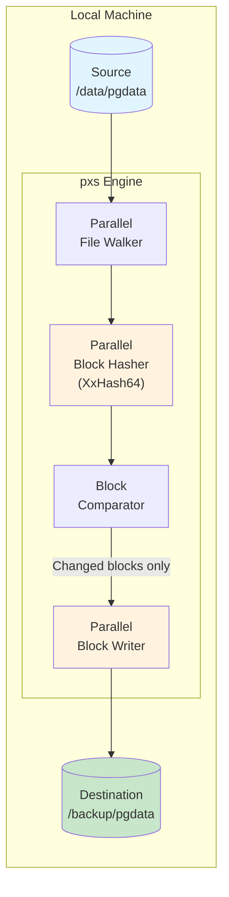
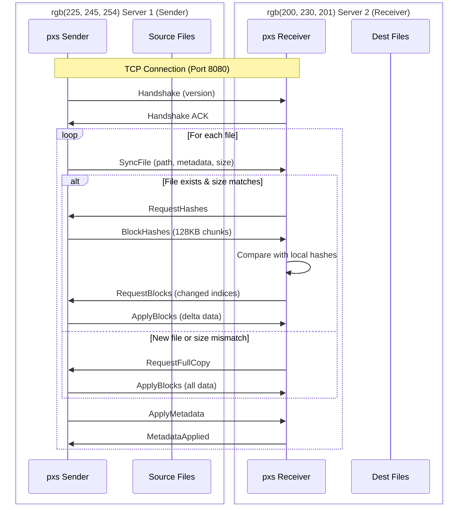
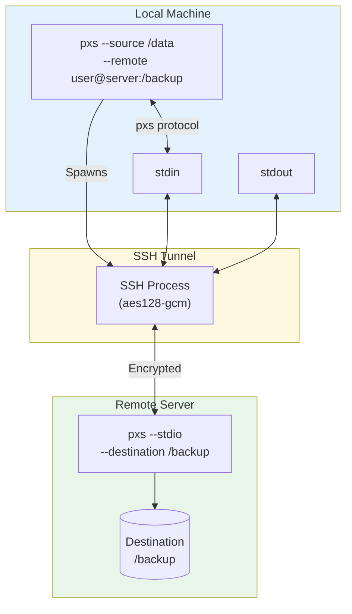
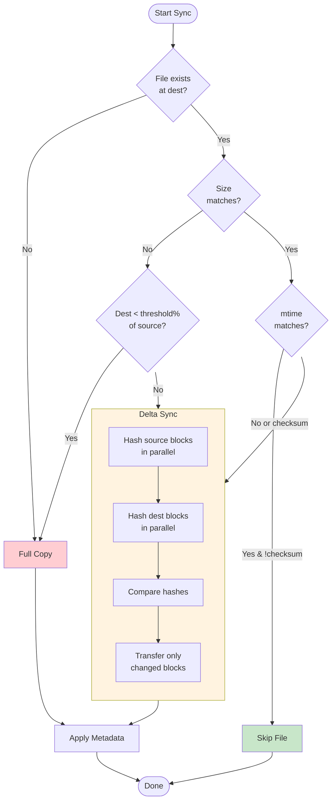

# pxs

**pxs** (Parallel X-Sync) is a high-performance, concurrent file synchronization tool written in Rust. Designed to saturate high-speed networks (10GbE+) and utilize multi-core CPUs for extremely fast data transfers and incremental updates.

The name is intentionally short for CLI use: `pxs` stands for **Parallel X-Sync**.

`pxs` is specifically optimized for massive data moves (e.g., 4TB+ Postgres `PG_DATA`) where standard tools like `rsync` often bottleneck on single-threaded hashing or SSH encryption overhead.

## Key Features

*   **Multi-threaded Engine**: Parallelizes file walking, block-level hashing, and I/O operations.
*   **Fixed-Block Synchronization**: Uses **128KB** chunks and **XxHash64** for ultra-fast delta analysis.
*   **Zero-Copy Networking**: High-speed network protocol using **rkyv** serialization over raw TCP.
*   **Auto-SSH Mode**: Seamlessly tunnels through SSH for secure transfers without manual port forwarding.
*   **Pull Mode**: Supports both pushing to and pulling from remote servers.
*   **In-place Updates**: Modifies existing files directly without creating large temporary files.
*   **Smart Skipping**: Automatically skips unchanged files based on size and modification time.

## Installation

Install from crates.io:

```bash
cargo install pxs
```

Build from source:

```bash
cargo build --release
```
The binary will be available at `./target/release/pxs`.

> [!IMPORTANT]
> For **Network** or **SSH** synchronization, `pxs` must be installed and available in the `$PATH` on **both** the source and destination servers.

## How It Works

### Local Synchronization



### Network Synchronization (Direct TCP)



### SSH Synchronization (Auto-Tunnel)



### Delta Sync Algorithm



## Usage

### 1. Local Synchronization
Synchronize a single file:
```bash
pxs --source file.bin --destination backup.bin
```

Synchronize a directory:
```bash
pxs --source /path/to/source_dir --destination /path/to/dest_dir
```

### 2. Network Synchronization (Direct TCP)
Best for high-speed local networks where maximum performance is needed (no encryption overhead).

**A. Pushing to a Receiver (Remote is getting the file)**
*   **Receiver (Server 2):**
    ```bash
    pxs --listen 0.0.0.0:8080 --destination /new/data
    ```
*   **Sender (Server 1):**
    ```bash
    pxs --remote 192.168.1.10:8080 --source /old/data/file.bin
    ```

**B. Pulling from a Sender (You are getting the file)**
*   **Sender (Server 2):**
    ```bash
    pxs --listen 0.0.0.0:8080 --source /old/data/file.bin --sender
    ```
*   **Receiver (Server 1):**
    ```bash
    pxs --remote 192.168.1.10:8080 --destination ./local_copy.bin --pull
    ```

### 3. Secure Network Synchronization (SSH)
Easiest way to sync securely between servers. `pxs` automatically spawns an SSH tunnel.

**Push (Local -> Remote):**
```bash
pxs --source my_file.bin --remote user@remote-server:/path/to/dest/my_file.bin
```

**Pull (Remote -> Local):**
```bash
pxs --remote user@remote-server:/path/to/remote/file.bin --destination ./local_file.bin --pull
```

**Manual SSH (using stdio pipe):**
If you need custom SSH flags, you can use the `--stdio` mode manually:
```bash
ssh user@remote-server "pxs --stdio --destination /path/to/new/data" < <(pxs --remote - --source /path/to/old/data)
```

### 4. Advanced Options

*   **`--checksum` (-c)**: Force a block-by-block hash comparison even if size/mtime match.
*   **`--ignore` (-i)**: (Repeatable) Skip files/directories matching a glob pattern (e.g., `-i "*.log"`).
*   **`--exclude-from` (-E)**: Read exclude patterns from a file (one pattern per line).
*   **`--threshold` (-t)**: (Default: 0.5) If the destination file is less than X% the size of the source, perform a full copy instead of hashing.
*   **`--dry-run` (-n)**: Show what would have been transferred without making any changes.
*   **`--verbose` (-v)**: Increase logging verbosity (use `-vv` for debug).

### Exclude Example
If you want to skip Postgres configuration files during a sync:
```bash
pxs --source /var/lib/postgresql/data --destination /backup/data \
  --ignore "postmaster.opts" \
  --ignore "pg_hba.conf" \
  --ignore "postgresql.conf"
```

Or using a file:
```bash
echo "postmaster.pid" > excludes.txt
echo "*.log" >> excludes.txt
pxs -s /src -d /dst -E excludes.txt
```

## How the Ignore Mechanism Works

`pxs` uses the same high-performance engine as `ripgrep` (the `ignore` crate) to filter files during the synchronization process.

### Default Behavior (Full Clone)
By default, `pxs` is configured for **Total Data Fidelity**. It will **NOT** skip:
*   Hidden files or directories (starting with `.`).
*   Files listed in `.gitignore`.
*   Global or local ignore files.

### Using Patterns (Globs)
When you provide patterns via `--ignore` or `--exclude-from`, they are applied as **overrides**. Matching files are skipped entirely: they are not hashed, not counted in the total size, and not transferred.

| Pattern | Effect |
| :--- | :--- |
| `postmaster.pid` | Ignores this specific file anywhere in the tree. |
| `*.log` | Ignores all files ending in `.log`. |
| `temp/*` | Ignores everything inside the top-level `temp` directory. |
| `**/cache/*` | Ignores everything inside any directory named `cache` at any depth. |

### Exclusion Pass-through (SSH)
When using **Auto-SSH mode**, your local ignore patterns are automatically sent to the remote server. This ensures that the receiver doesn't waste time looking at files you've already decided to skip.

## Why pxs is faster than rsync

| Feature | rsync | pxs |
|---------|-------|-----|
| File hashing | Single-threaded | **Parallel** (all CPU cores) |
| Block comparison | Single-threaded | **Parallel** |
| Network connections | Single | **Multiple workers** |
| Directory walking | Sequential | **Parallel** |
| Algorithm | Rolling hash | Fixed 128KB blocks |

1.  **Parallelism**: `rsync` is largely single-threaded. `pxs` uses all available CPU cores to hash different parts of your data simultaneously.
2.  **Algorithm Efficiency**: For database files (like Postgres), data is modified in-place and never "shifted." `pxs` uses a fixed-block algorithm that is much lighter than `rsync`'s rolling hash.
3.  **No Encryption Bottleneck**: By using raw TCP (when appropriate), `pxs` avoids the CPU overhead of SSH encryption which often caps transfers at ~120MB/s.

## Tests

The project includes a robust test suite for both local and network logic:
```bash
# Run all tests
cargo test
```

## License

BSD-3-Clause
